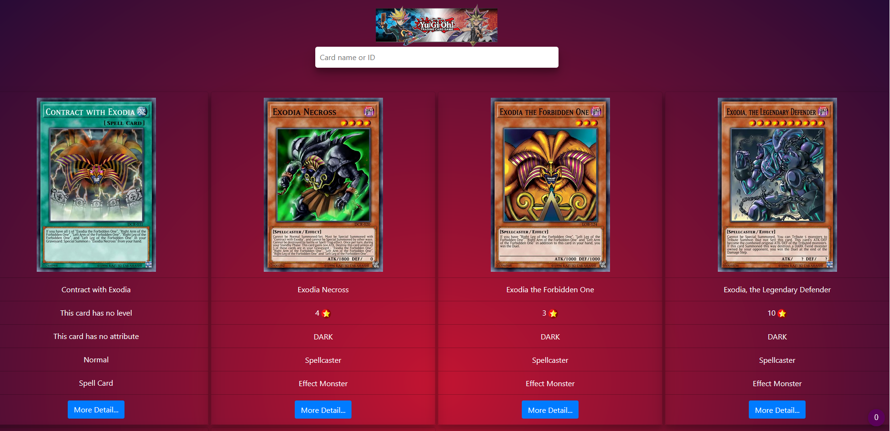

# YU GI OH | 遊 ☆ 戯 ☆ 王

<div align="center">

</div>

A simple one page app that consumes the yugioh api and displays the details about the cards.
The app uses the 'https://db.ygoprodeck.com/api-guide/' V5 api to fetch the data.

<div align="center">

</div>

## How does it work :

```
By Default the list of card displayed when the page is accessed are EXODIA's.
This can be changed in the code to which ever card you want or tinker and diasble the list at the launch .
```

<div align="center">

</div>

## Card Detail

```
Click on **More Detail** to display the flavour text of the card .
```

<div align="center">

</div>

## Tips

```php
# in case of the error : Unable to find the wrapper “https”
# enable this extension in the php.ini

;extension=php_openssl

```

## Contact

```
you can contact me at ZTF666@protonmail.ch or via my portfolio

```

<div align="center">

<table>
  <tr>
    <td align="center"><a href="https://ztfportfolio.web.app/" target='_blank'><br /><sub><b>ZTF666</b></sub></a></td>
  </tr>
</table>

</div>

## License

**💎YU GI OH | 遊 ☆ 戯 ☆ 王 💎** released under the [MIT](LICENSE) License.
<br><br>

<div align="center">
<strong><p>Made with 💘 by a 👨‍💻 on a 💻 | 2020 | ZTF666 - N.EA</p> </strong>
</div>
