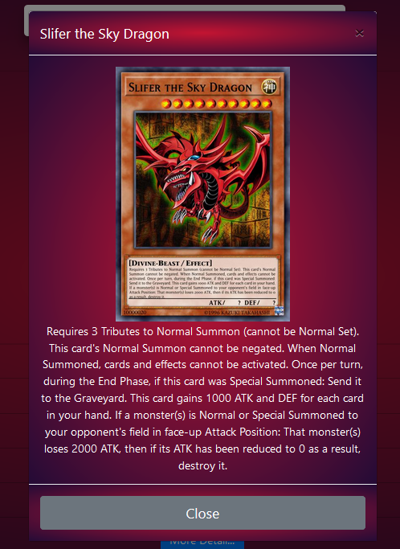

# YuGiOh_Card_Lister_PHP


A simple one page app that consumes the yugioh api and displays the details about the cards.
The app uses the 'https://db.ygoprodeck.com/api-guide/' V5 api to fetch the data.


## Empty List


## Card Detail


## Card Search


## Project setup
```
You can run the page on any server( i guess ).
 This is what i used in my setup :
 Apache 2.4.25 - PHP 7.1.3 
 ```
 
 ### Notice 
 ```
 You can use the project , modify it in any way you wish as long as you credit me !
 you can reach me @ZTF666@protonmail.ch
```
